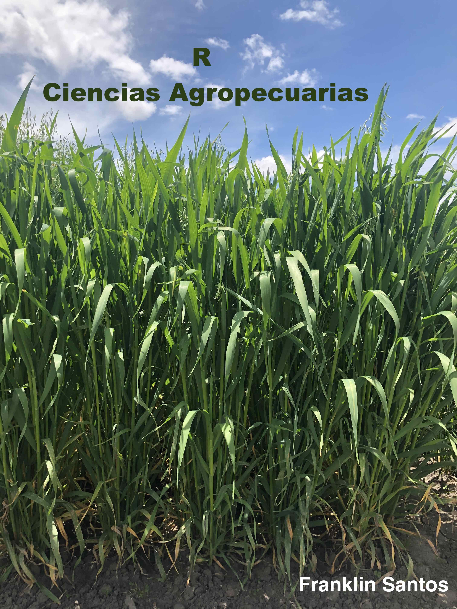

--- 
title: "R en las Ciencias Agropecuarias"
author: "Franklin Santos"
date: "`r Sys.Date()`"
twitter-handle: FranklinSantosM
cover-image: cover.jpg
site: bookdown::bookdown_site
documentclass: book
bibliography: [book.bib, packages.bib]
biblio-style: apalike
link-citations: yes
description: "En este libro encontrarás una compilación de paquetes estadísticos aplicadas a las ciencias agropecuarias. The output format for this example is bookdown::gitbook."
---

# Bienvenido {-}

<a href="https://www.franklinsantos.com"></a>

Bienvenido a **R aplicada en las Ciencias Agropecuarias**. El contenido del libro presenta ejemplos de análisis exploratorio de datos, estadística inferencial y modelos de regresión. Generalmente, se expone las metodologías mas usuales en un reporte de trabajos de investigación y/o tesis. 

Este libro es para aquellos que tienen poca o ninguna experiencia previa en programación en R o cualquier otro lenguaje de programación. Su objetivo es desarrollar los conceptos básicos y enseñarle las capacidades de R. Con la lectura y práctica, habrá adquirido una nueva habilidad valiosa para explorar conjuntos de datos y crear visualizaciones impresionantes.

## Prerequisites

This is a _sample_ book written in **Markdown**. You can use anything that Pandoc's Markdown supports, e.g., a math equation $a^2 + b^2 = c^2$.

The **bookdown** package can be installed from CRAN or Github:

```{r eval=FALSE}
install.packages("bookdown")
# or the development version
# devtools::install_github("rstudio/bookdown")
```

Remember each Rmd file contains one and only one chapter, and a chapter is defined by the first-level heading `#`.

To compile this example to PDF, you need XeLaTeX. You are recommended to install TinyTeX (which includes XeLaTeX): <https://yihui.org/tinytex/>.

```{r include=FALSE}
# automatically create a bib database for R packages
knitr::write_bib(c(
  .packages(), 'bookdown', 'knitr', 'rmarkdown'
), 'packages.bib')
```
